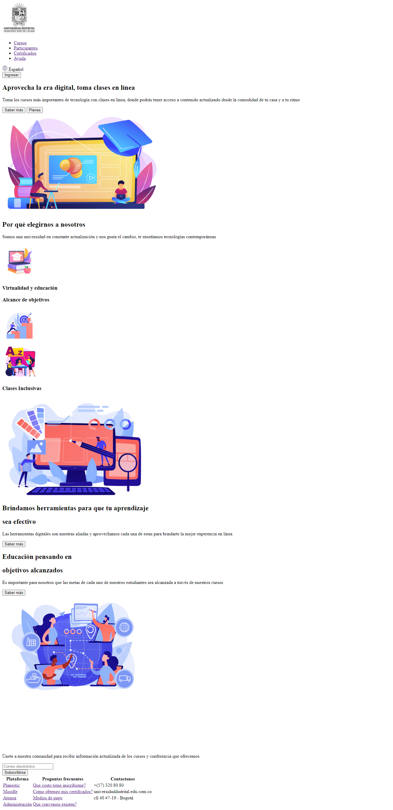
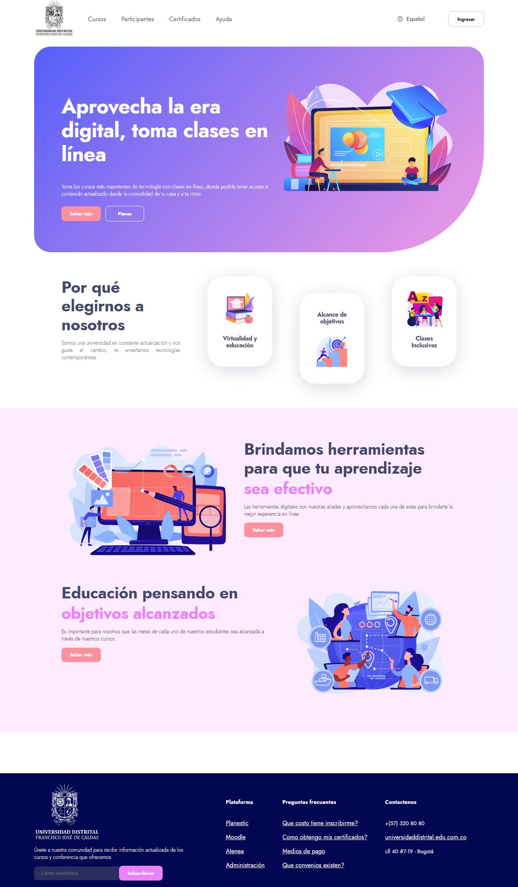
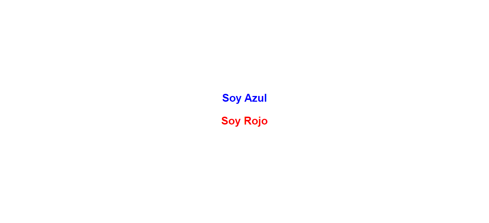
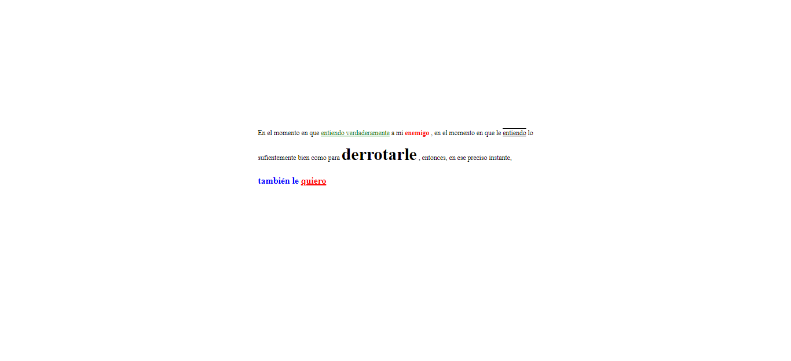
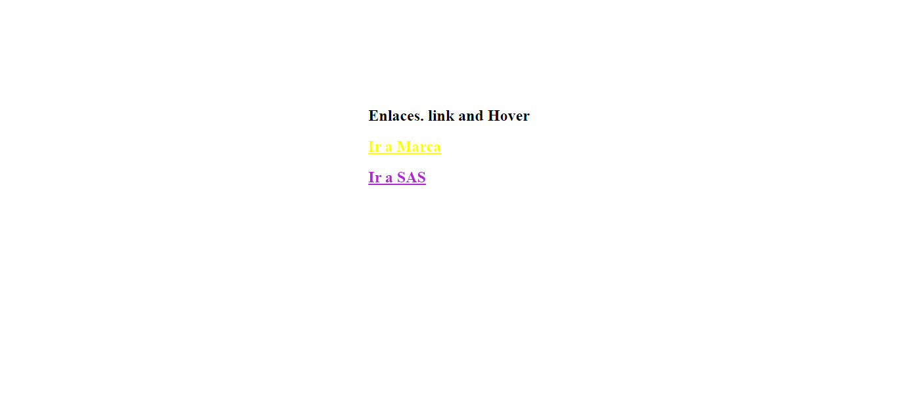
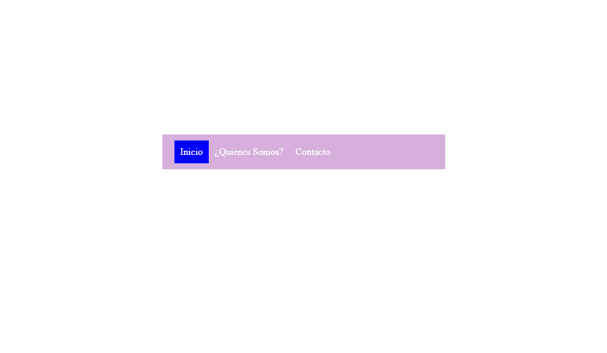

<h1>Taller 9 Johann Alberto Tocora Rodriguez</>

<h2>Información</h2>

Curso Full Stack Básico - Grupo 1

Profesor: Cristian Patiño 

<h2>Punto 1 : Link de Figma</h2>
<a href="https://www.figma.com/file/XZjr1jfLn81j5EmHUiKqWj/Johann-Tocora---Wireframe%2FMockup-Exercise-Rita?type=design&node-id=0-1&t=XTOM8ehrnguAybUO-0">Link de Figma</a>
 
<a href="https://jtocorarod.github.io/taller-9-full-stack/">Link Página Web </a>

<h2>Punto 2 : HTML</h2>

<h2>Punto 3 : CCS</h2>

<h2>Punto 4 </h2>

<h2>Punto 5 </h2>

<h2>Punto 6 </h2>

<h2>Punto 7-8 </h2>

